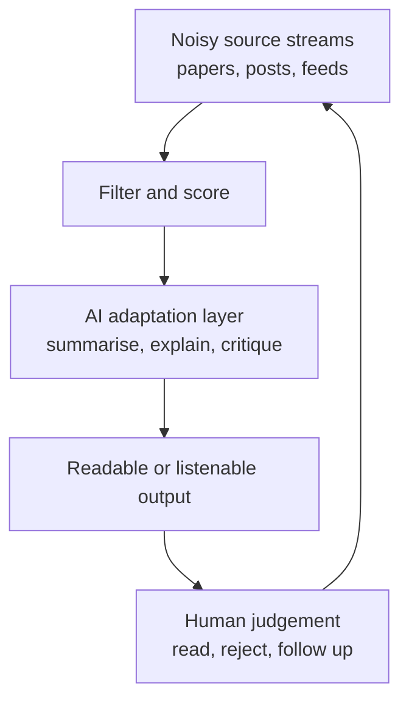

# benpearson.dev Blog

Generate draft Hugo posts directly in the `benpearson.dev` repository while preserving Ben's writing voice and keeping publishing explicit.

## Core Rules

- Work directly in `/home/ben/dev/benpearson.dev` unless the user gives another path.
- Do not use Obsidian for this workflow. Do not read from or write to the vault unless the user explicitly asks.
- Read `/home/ben/dev/benpearson.dev/README.md` before creating or editing a post.
- Create posts as Hugo page bundles: `content/writing/<slug>/index.md`.
- Put post media in the same bundle as `index.md`; reference media with relative paths.
- Set `draft: true` by default.
- Do not commit, push, or publish unless the user explicitly asks.
- Preview drafts with `hugo server -D --port 1313`.

## Required Frontmatter

Use this shape unless the repo README has changed:

```yaml
---
title: "Readable Public Title"
slug: readable-public-title
content_type: post
summary: "Short summary for listings."
date: YYYY-MM-DD
draft: true
tags:
  - example
---
```

`content_type` must be `post` or `lab`. Use `lab` for experiments, build notes, implementation write-ups, and rougher practical notes. Use `post` for more polished articles.

## Workflow

1. Read the Hugo repo README.
2. If the topic, angle, `content_type`, source material, concrete examples, implementation details, or external links are unclear, ask concise questions before drafting rather than guessing.
3. Choose a lowercase hyphenated slug.
4. Create `content/writing/<slug>/index.md` with `draft: true`.
5. Draft using the article quality principles, generator-critic workflow, `references/ben-website-writing-style-profile.md`, and `references/ben-blog-feedback-patterns.md`.
6. For engineer-facing AI workflow or automation posts, apply the structure guidance below before presenting the result.
7. Run an anti-AI editing pass before presenting the result.
8. Run a reader-question pass: list what an interested reader might still ask after reading the draft, then either answer those questions in the article, ask Ben for the missing detail, or explicitly leave them out if they are out of scope.
9. Check that named external projects, repositories, tools, posts, and references have appropriate links when a public URL is known or can be safely discovered. Ask Ben when the link target is ambiguous.
10. Tell the user how to preview locally.

## Article Quality Principles

Use these principles before and during generation. They are not a replacement for Ben's voice; they are checks that help the post become interesting and understandable.

- Start with a concrete moment, number, conflict, decision, or surprising observation rather than the topic in the abstract.
- Make the reader promise clear: why should someone keep reading this post?
- Bring out the tension: what was confusing, broken, annoying, surprising, or non-obvious?
- Assume the reader may be unfamiliar with the concept Ben is introducing. Comprehension is more important than strict brevity.
- Move from concrete detail to reusable pattern. Do not start with the general lesson unless the source material demands it.
- Prefer examples, before/after comparisons, loops, and small scenes when they help the idea land.
- Prefer enough implementation detail that an interested reader could reuse the pattern: configuration boundaries, prompts, schemas, commands, permission models, and worked examples when relevant.
- Cut sections that only restate the thesis or make the post sound tidier without adding understanding.
- Avoid a neat essay voice where every paragraph sounds too balanced, symmetrical, or final.
- End with useful judgement or an unresolved tradeoff, not a polished moral.

### Reader Comprehension Test

Before cutting structure for minimalism, ask whether a reader new to the idea would understand the post faster with the extra scaffolding. Keep scaffolding when it helps comprehension.

Use diagrams, bullets, tables, or code blocks when they explain something prose would make harder to hold in the reader's head, especially:

- A feedback loop.
- A pipeline or sequence of steps.
- A system boundary or handoff.
- A cause/effect chain.
- A comparison that needs multiple variables visible at once.

Remove these elements only when they duplicate nearby prose or add visual noise without improving understanding.

## Generator-Critic Drafting Workflow

Use a two-pass generator and critic pattern for new posts and substantial rewrites. The goal is not to make the post sound more polished; it is to make the argument sharper, more specific, and less generically AI-written.

### Pass 1: Generator

Write the first draft as a generator with a clear brief:

- Identify the real point Ben is trying to make, not just the topic.
- Choose the strongest narrative angle and opening problem.
- Preserve concrete details from the source material: dates, numbers, tools, constraints, decisions, failures, and tradeoffs.
- Structure the post with scannable `##` sections.
- Include quote callouts and Mermaid diagrams only where they clarify the argument.
- Prefer a slightly rough but specific draft over a smooth generic one.

Before writing the file, decide whether the post is mainly:

- A practical engineering narrative.
- A reflective personal post.
- A lab note or implementation write-up.
- A hybrid of those forms.

### Pass 2: Critic

After the first draft exists, critique it adversarially before presenting it to Ben. The critic should look for:

- A weak or generic opening.
- Claims that sound plausible but are not supported by the source material.
- Missing concrete details that would make the post more useful.
- Sections that repeat the same point in different words.
- Over-explaining obvious context while under-explaining the interesting mechanism.
- AI-ish rhythm: neat symmetry, generic lessons, corporate phrasing, or over-smoothed transitions.
- Unclear audience: too much detail for a general reader, or too little for a technical reader.
- Tables, diagrams, or code blocks that add formatting noise rather than clarity, while preserving any that help a reader understand a new concept or mental model.
- Missing links for named external projects, repos, tools, source material, or public references.
- Reader questions left unanswered: after reading the draft, what would a practical reader ask next, and does the article answer it?
- A conclusion that feels too tidy or moralising.

The critic should produce a short internal review, not a user-facing essay. Prioritise the 3-6 changes most likely to improve the post.

For practical engineering articles, the critic must include a reader-question check before approving the draft. It should identify questions a reader might reasonably ask, such as:

- What exactly is configured?
- What credentials, permissions, or accounts are separated?
- What prompt, schema, command, or file shape is used?
- Where can I see the referenced tool, skill, repo, or source?
- What is a concrete example of the workflow over time?
- What can go wrong, and how is the risk contained?

If the article cannot safely answer a useful reader question from the available source material, ask Ben a concise question before inventing details.

### Pass 3: Rewrite

Revise the draft by applying the critic's strongest points:

- Fix the opening if it does not start from a concrete problem or observation.
- Cut duplicated or generic paragraphs.
- Add missing specifics from the source material where they improve trust or usefulness.
- Add public links for named tools, repos, references, or external projects when available and relevant.
- Add worked examples, prompt excerpts, schema snippets, command examples, or before/after flows when they help the reader reuse the idea.
- Reorder sections if the argument currently arrives too late.
- Replace abstract claims with practical consequences.
- Keep diagrams, tables, quote callouts, and code blocks when they materially improve reader comprehension, especially for unfamiliar workflows or concepts. Remove them only when they duplicate prose or add noise without helping understanding.
- Keep Ben's voice plain and owned; do not make the rewrite sound like marketing copy.

Only after the rewrite should the post be considered ready to show. If the critic finds a major source-material gap that cannot be fixed safely, ask Ben one short question rather than inventing detail.

When multiple missing details would materially improve the article, ask Ben a short grouped question before drafting or rewriting. Prefer specific prompts such as: "Which credential boundary is safe to describe publicly?", "Can I quote or paraphrase the actual prompt?", "What frontmatter fields should be shown?", or "What is one real example of this compounding over time?"

When the Task tool is available and the task is substantial, prefer using separate subagents for the generator and critic passes, then synthesize the final rewrite yourself. The generator may write or propose the draft; the critic should be read-only and adversarial.

## Engineer-Facing Post Structure

When the likely audience is engineers interested in automation, agents, AI workflows, or practical system design, prefer a practical engineering narrative over an abstract essay.

Use this shape unless the user asks for a different style:

- Start with the concrete problem and why the obvious manual workflow fails.
- Use distinct `##` sections so the article can be scanned.
- Explain the system shape and the design choices that mattered.
- Include implementation detail where it helps readers reuse the idea: inputs, selection, queueing, generation, review, delivery, feedback loops, failure modes.
- Preserve Ben's judgement: make clear what the system does, what it does not do, and where human review remains.
- End by extracting the reusable pattern or lesson, not with a generic conclusion.

Good section types:

- `## The Problem`
- `## The Pattern`
- `## Workflow 1: ...`
- `## Design Choices That Matter`
- `## Provenance And Review`
- `## The Reusable Pattern`
- `## The Trap`
- `## What I Would Improve Next`

## Quote Callouts

Use Markdown blockquotes for significant ideas worth slowing down for. These should read like distilled claims, not motivational slogans.

Good:

```markdown
> The hard part is not finding more AI material. It is turning the right material into attention I will actually spend.
```

Use 2-4 quote callouts in a medium-length post. Prefer them for:

- The core thesis.
- A surprising design choice.
- A reusable principle.
- A trap or warning.

Avoid quote callouts for generic lines like "AI is changing how we work".

## Mermaid Diagrams

When a subject is complicated, creative, or has multiple workflow steps, include a Mermaid diagram rather than explaining everything in prose.

Use diagrams for:

- Pipelines: discovery -> filtering -> generation -> review -> delivery.
- Feedback loops: output -> human judgement -> tuning.
- Agent workflows with multiple roles or handoffs.
- Architecture where the boundary between human judgement and AI automation matters.

Keep diagrams readable:

- Prefer one high-level diagram over several dense diagrams.
- Use semantic node names, not `A`, `B`, `C`, except for tiny examples.
- Keep labels short; use `<br/>` for line breaks inside nodes.
- Explain the design choices after the diagram.

Example:

````markdown

````

## Voice Rules

Use the bundled style profile as the source of truth. In short:

- Write like clear written conversation.
- Prefer first person when discussing Ben's own process, judgement, or experiments.
- Use plain, practical words over corporate or literary language.
- Prefer flowing sentences over clipped, choppy prose.
- Be confident where the point is clear, but leave room for judgement.
- Avoid generic AI openings, SaaS brochure language, over-polished symmetry, and forced casualness.
- For technical audiences, prefer concrete system details over high-level reflection. The reflective point should emerge from the workflow details.

## Common Mistakes

| Mistake | Correct behaviour |
|---|---|
| Creating `src/content/posts/*.md` | Use `content/writing/<slug>/index.md` |
| Creating `content/lab-notes/*.md` | Use `content/writing/<slug>/index.md` with `content_type: lab` |
| Putting images in `static/images/...` | Put media beside `index.md` in the page bundle |
| Publishing because the user said "quickly" | Keep `draft: true` unless explicitly told to publish |
| Reading the vault style note at runtime | Use the bundled style reference in this skill |
| Writing generic AI prose | Revise against the style profile before presenting |
| Writing one long unsectioned essay for an engineer audience | Add `##` sections, quote callouts, and diagrams where the workflow has steps |
| Explaining a multi-step automation only in prose | Add a Mermaid diagram and then explain the design choices |
| Staying too abstract for agent/workflow posts | Include inputs, handoffs, review steps, delivery path, and failure modes |

## Publishing

Publishing is a separate explicit action. To publish, the user must ask for it or approve it clearly. The publishing edit is to remove `draft: true` or set `draft: false`, then commit and push according to the repo workflow.

If the user asks to "push it live", "publish", "deploy", or similar, treat that as explicit publishing intent. If the wording is only "draft", "preview", "prepare", "write", or "generate", keep `draft: true` and do not commit or push.

## Post-Generation Feedback Loop

Use this only after an article draft or rewrite has been generated and Ben gives feedback. Do not let the feedback-training mechanism distract from first producing the best article possible.

If Ben provides sentences, paragraphs, or sections he dislikes:

1. Rewrite the specific text first.
2. Briefly explain what changed and why.
3. Extract any durable writing preference that should apply to future posts.
4. Propose the preference rule before writing it down.
5. If Ben approves, update `references/ben-blog-feedback-patterns.md` in both the installed skill and the `~/dev/agent-skills` repo copy when available.

Feedback examples worth capturing:

- Sentences that sound too generic, tidy, or AI-written.
- Places where useful diagrams or scaffolding were removed too aggressively.
- Missing context that made the post harder for an unfamiliar reader to understand.
- Phrases that sound unlike Ben's judgement or rhythm.
- Overly neat conclusions that should leave more room for tradeoff or uncertainty.
