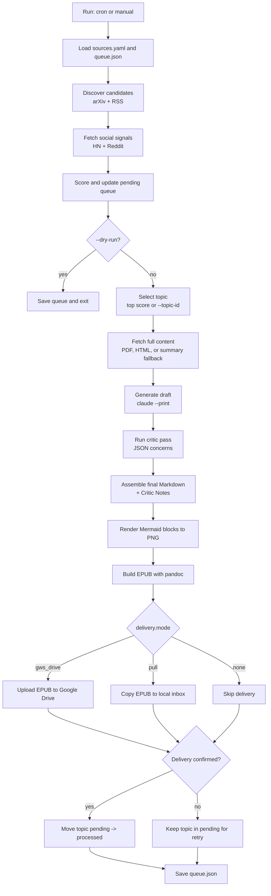

# Kobo EPUB Pipeline

Generate one long-form AI deep-dive EPUB per run and deliver it with a pull-friendly sync path for Kobo.

## How It Works

Mermaid source file: [`pipeline.mmd`](pipeline.mmd)



## Prerequisites

- Python: `python3`
- Python packages:
  - `feedparser`
  - `arxiv`
  - `requests`
  - `pyyaml`
  - `beautifulsoup4`
  - `pdfminer.six` (optional but recommended for PDF extraction)
- External CLIs:
  - `claude`
  - `pandoc`
  - `mmdc`
  - `gws` (required for `delivery.mode: gws_drive`)

## Quick Start

```bash
cd skills/kobo-epub-pipeline
cp kobo_reader_state/sources.example.yaml kobo_reader_state/sources.yaml
```

Edit `kobo_reader_state/sources.yaml`:

- Set `delivery.mode` (recommended: `gws_drive`)
- Set `delivery.gws_drive.folder_id`
- Optionally set `delivery.gws_drive.config_dir` for machine-profile isolation

Run the pipeline:

```bash
# Crawl, score, and queue only
python3 kobo_daily_reader.py --dry-run

# Build one EPUB and deliver according to delivery.mode
python3 kobo_daily_reader.py
```

Useful flags:

```bash
# Build only, skip delivery
python3 kobo_daily_reader.py --no-sync --output-dir ~/Desktop

# Force a specific queued topic
python3 kobo_daily_reader.py --topic-id arxiv:2401.12345v1
```

## Delivery Semantics

- A topic is moved from `pending` to `processed` only after delivery succeeds.
- If delivery fails, the topic stays in `pending` and is retried on the next run.
- This makes the pipeline queue-safe for intermittent network or service failures.

See [`SKILL.md`](SKILL.md) for full setup and troubleshooting details.
