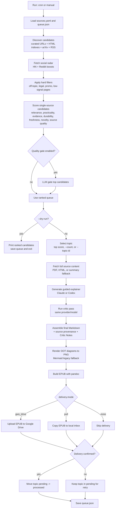

# Kobo EPUB Pipeline

Generate one long-form AI deep-dive EPUB from a high-signal single-source topic and deliver it with a pull-friendly sync path for Kobo.

## How It Works

Mermaid source file: [`pipeline.mmd`](pipeline.mmd)


```mermaid
flowchart TD
  A[Run: cron or manual] --> B[Load sources.yaml and queue.json]
  B --> C[Discover candidates<br/>curated URLs + HTML indexes + arXiv + RSS]
  C --> D[Fetch social radar<br/>HN + Reddit boosts]
  D --> E[Apply hard filters<br/>off-topic, legal, promo, low-signal pages]
  E --> F[Score single-source candidates<br/>relevance, practicality, evidence, durability, freshness, novelty, source quality]
  F --> G{Quality gate enabled?}
  G -->|yes| H[LLM gate top candidates]
  G -->|no| I[Use ranked queue]
  H --> I
  I --> J{--dry-run?}
  J -->|yes| K[Print ranked candidates<br/>save queue and exit]
  J -->|no| L[Select topic<br/>top score, --count, or --topic-id]
  L --> M[Fetch full source content<br/>PDF, HTML, or summary fallback]
  M --> N[Generate guided explainer<br/>Claude or Codex]
  N --> O[Run critic pass<br/>same provider/model]
  O --> P[Assemble final Markdown<br/>+ source provenance + Critic Notes]
  P --> Q[Render DOT diagrams to PNG<br/>Mermaid legacy fallback]
  Q --> R[Build EPUB with pandoc]
  R --> S{delivery.mode}
  S -->|gws_drive| T[Upload EPUB to Google Drive]
  S -->|pull| U[Copy EPUB to local inbox]
  S -->|none| V[Skip delivery]
  T --> W{Delivery confirmed?}
  U --> W
  V --> W
  W -->|yes| X[Move topic pending -> processed]
  W -->|no| Y[Keep topic in pending for retry]
  X --> Z[Save queue.json]
  Y --> Z
```

## Prerequisites

- Python: `python3` in a venv is recommended.
- Python packages: `feedparser`, `arxiv`, `requests`, `pyyaml`, `beautifulsoup4`, `pdfminer.six`.
- Generation CLI: `codex` or `claude`.
- EPUB build CLI: `pandoc`.
- Diagram CLI: `dot` from Graphviz.
- Delivery CLI: `gws` for `delivery.mode: gws_drive`.
- Optional CLIs: `mmdc` for legacy Mermaid rendering, `kepubify` for KEPUB conversion.

## Quick Start

```bash
cd skills/kobo-epub-pipeline
cp kobo_reader_state/sources.example.yaml kobo_reader_state/sources.yaml
```

Edit `kobo_reader_state/sources.yaml`:

- Set `delivery.mode` to `gws_drive` for Kobo pull sync.
- Set `delivery.gws_drive.folder_id`.
- Optionally set `delivery.gws_drive.config_dir` for machine-profile isolation.
- Set `generation.provider` to `codex` or `claude`.
- Keep `selection.mode: single_source_deep_read` for the current improved workflow.
- Tune feeds, HTML indexes, arXiv queries, and scoring keywords for your reading goals.

Run the pipeline:

```bash
# Crawl, score, gate, and queue only
python3 kobo_daily_reader.py --dry-run

# Build one EPUB and deliver according to delivery.mode
python3 kobo_daily_reader.py --count 1
```

Useful flags:

```bash
# Build only, skip delivery
python3 kobo_daily_reader.py --no-sync --output-dir ~/Desktop

# Force a specific queued topic
python3 kobo_daily_reader.py --topic-id rss:abc123def45678
```

## Delivery Semantics

- A topic is moved from `pending` to `processed` only after delivery succeeds.
- If delivery fails, the topic stays in `pending` and is retried on the next run.
- This makes the pipeline queue-safe for intermittent network or service failures.
- Drive retention can be enabled to remove older generated EPUBs without touching unrelated files.

## EPUB Output

- Filenames preserve spaces for Kobo wrapping: `YYYYMMDD - Topic Title - source id.epub`.
- EPUB metadata includes `title`, `author`, and `publisher`.
- Generated covers are enabled by default and fall back cleanly to a no-cover build if Pandoc rejects the cover asset.
- Each EPUB includes source provenance, scoring details, social radar values, quality-gate verdict, and critic notes.

See [`SKILL.md`](SKILL.md) for full setup and troubleshooting details.
