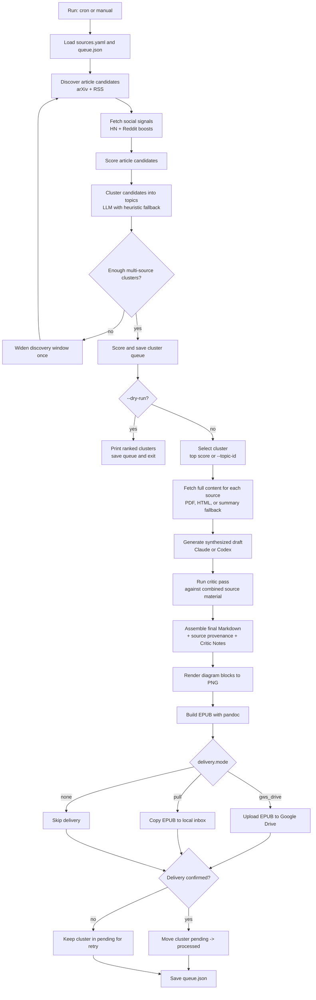

# Kobo EPUB Pipeline

Generate one long-form AI deep-dive EPUB from a multi-source topic cluster and deliver it with a pull-friendly sync path for Kobo.

## How It Works

Mermaid source file: [`pipeline.mmd`](pipeline.mmd)


```mermaid
flowchart TD
  A[Run: cron or manual] --> B[Load sources.yaml and queue.json]
  B --> C[Discover article candidates<br/>arXiv + RSS]
  C --> D[Fetch social signals<br/>HN + Reddit boosts]
  D --> E[Score article candidates]
  E --> F[Cluster candidates into topics<br/>LLM with heuristic fallback]
  F --> G{Enough multi-source clusters?}
  G -->|no| H[Widen discovery window once]
  H --> C
  G -->|yes| I[Score and save cluster queue]
  I --> J{--dry-run?}
  J -->|yes| K[Print ranked clusters<br/>save queue and exit]
  J -->|no| L[Select cluster<br/>top score or --topic-id]
  L --> M[Fetch full content for each source<br/>PDF, HTML, or summary fallback]
  M --> N[Generate synthesized draft<br/>Claude or Codex]
  N --> O[Run critic pass<br/>against combined source material]
  O --> P[Assemble final Markdown<br/>+ source provenance + Critic Notes]
  P --> Q[Render diagram blocks to PNG]
  Q --> R[Build EPUB with pandoc]
  R --> S{delivery.mode}
  S -->|gws_drive| T[Upload EPUB to Google Drive]
  S -->|pull| U[Copy EPUB to local inbox]
  S -->|none| V[Skip delivery]
  T --> W{Delivery confirmed?}
  U --> W
  V --> W
  W -->|yes| X[Move cluster pending -> processed]
  W -->|no| Y[Keep cluster in pending for retry]
  X --> Z[Save queue.json]
  Y --> Z
```

## Prerequisites

- Python: `python3`
- Python packages:
  - `feedparser`
  - `arxiv`
  - `requests`
  - `pyyaml`
  - `beautifulsoup4`
  - `pdfminer.six` (optional but recommended for PDF extraction)
- External CLIs:
  - `claude`
  - `pandoc`
  - `mmdc`
  - `gws` (required for `delivery.mode: gws_drive`)

## Quick Start

```bash
cd skills/kobo-epub-pipeline
cp kobo_reader_state/sources.example.yaml kobo_reader_state/sources.yaml
```

Edit `kobo_reader_state/sources.yaml`:

- Set `delivery.mode` (recommended: `gws_drive`)
- Set `delivery.gws_drive.folder_id`
- Optionally set `delivery.gws_drive.config_dir` for machine-profile isolation
- Set `build.publisher` if you want a publisher other than `Ben Pearson`
- Keep `build.cover_enabled: true` for generated per-article covers

Run the pipeline:

```bash
# Crawl, cluster, score, and queue only
python3 kobo_daily_reader.py --dry-run

# Build one EPUB and deliver according to delivery.mode
python3 kobo_daily_reader.py
```

Useful flags:

```bash
# Build only, skip delivery
python3 kobo_daily_reader.py --no-sync --output-dir ~/Desktop

# Force a specific queued cluster
python3 kobo_daily_reader.py --topic-id cluster:abc123def45678
```

## Delivery Semantics

- A topic cluster is moved from `pending` to `processed` only after delivery succeeds.
- If delivery fails, the cluster stays in `pending` and is retried on the next run.
- This makes the pipeline queue-safe for intermittent network or service failures.

## EPUB Output

- Filenames preserve spaces for Kobo wrapping: `YYYYMMDD - Topic Title - source id.epub`.
- EPUB metadata includes `title`, `author`, and `publisher`.
- Generated covers are enabled by default and fall back cleanly to a no-cover build if Pandoc rejects the cover asset.

See [`SKILL.md`](SKILL.md) for full setup and troubleshooting details.
