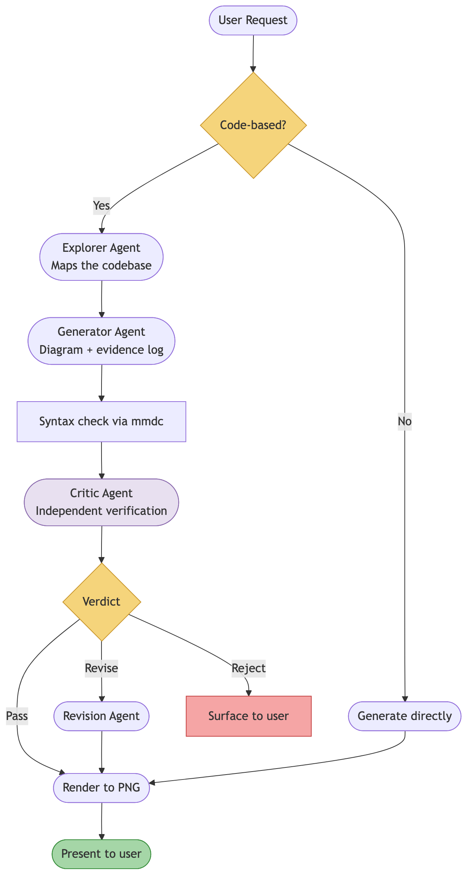
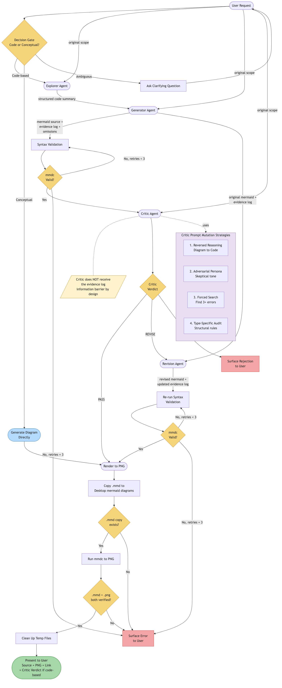

# Mermaid From Code

Generate verified mermaid diagrams from codebases using an adversarial generator+critic pipeline.

## The Problem

When generating mermaid diagrams from code, LLMs often make confident but incorrect assumptions about code relationships — phantom nodes that don't exist, reversed arrows, missing branches, or scope creep. A single-pass generation has no self-correction mechanism.

## How It Works



1. **Explorer** maps the relevant code surface area (components, relationships, entry points)
2. **Generator** produces a mermaid diagram plus a structured evidence log — every node and edge cites the file and line that justifies it
3. **Syntax check** validates the mermaid source via `mmdc` before any review
4. **Critic** independently explores the same codebase and verifies the diagram, using a deliberately mutated prompt to avoid agreeing with the generator's blind spots
5. If the critic finds issues, a single **revision** pass corrects them

For conceptual diagrams (no codebase involved), the adversarial pipeline is skipped and the diagram is generated directly.

### The Critic's Mutated Prompt

The key innovation is that the critic's prompt is deliberately constructed to produce independent reasoning:

- **Reversed reasoning** — works backwards from diagram to code, instead of code to diagram
- **Adversarial persona** — assumes the diagram contains mistakes until proven otherwise
- **Forced search** — must attempt to find at least 3 errors before approving
- **Type-specific audit** — applies structural rules for the specific diagram type (flowchart, sequence, class, state, ER)

The critic also does NOT receive the generator's evidence log, forcing genuinely independent verification.

### Detailed Pipeline

<details>
<summary>Click to expand the full pipeline diagram</summary>



</details>

## Installation

```bash
cp -r skills/mermaid-from-code ~/.claude/skills/
```

### Prerequisites

- [mermaid-cli](https://github.com/mermaid-js/mermaid-cli) — `npm install -g @mermaid-js/mermaid-cli`

## Usage

The skill triggers automatically when you ask Claude Code to create a mermaid diagram from code. For example:

- "Create a mermaid diagram of the auth flow in src/auth/"
- "Show me a sequence diagram of how the API handles requests"
- "Generate a class diagram of the models in this repo"

See [SKILL.md](SKILL.md) for the full orchestration spec.
