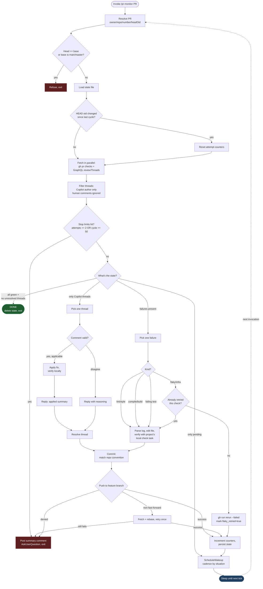

# PR Monitor

Autonomously monitor a GitHub PR — fix failing CI, process Copilot review feedback, push, and repeat until the PR is green and clean. Hands-off PR babysitting.

You point Claude at a PR (`/pr-monitor <url-or-number>`). Each tick it pulls the PR's check status and unresolved Copilot threads, fixes one thing, commits, pushes, and schedules the next tick via `ScheduleWakeup`. It halts and asks for help if a fix doesn't stick after two attempts, if cycle count exceeds a safety cap, or if it can't parse a failure.

**Hard rule:** only Copilot review threads are auto-processed. Comments from human reviewers are always left for the user.

## How It Works



Green = terminal success. Red = halt-and-ask. Blue = sleeping until the next scheduled tick.

## Installation

```bash
cp -r skills/pr-monitor ~/.claude/skills/
```

Then in Claude Code, invoke as `/pr-monitor <pr-url-or-number>`.

## Prerequisites

- **`gh` CLI** authenticated against the repo (`gh auth status` should show write access).
- **`git push` not blocked.** A common Claude Code setting is `"Bash(git push *)"` in the `deny` list, which is a hard block that per-call approval cannot override. Narrow it before running this skill, e.g.:
  ```json
  "deny": [
    "Bash(git push *--force*)",
    "Bash(git push *-f *)",
    "Bash(git push * origin main*)",
    "Bash(git push * origin master*)"
  ]
  ```
  This still blocks force-pushes and pushes to default branches but allows feature-branch pushes (always reversible).

## State

Per-PR state lives at `~/.claude/skills/pr-monitor/state/<owner>-<repo>-<pr>.json` — tracks attempt counts per check and per Copilot thread, the last-seen HEAD SHA (so a manual push from the user resets counters), and a cycle counter. Deleted when the PR reaches a clean green state.

## Stop conditions

The loop halts and asks the user via `AskUserQuestion` when:
- A fix has been attempted twice for the same check or Copilot thread
- The cycle counter exceeds 50 (safety cap)
- A push fails after one rebase retry
- A failure can't be parsed from CI logs
- A check is failing with no associated workflow run

A `[Claude]` summary comment is posted to the PR before halting, so all review surface lives in one place.
