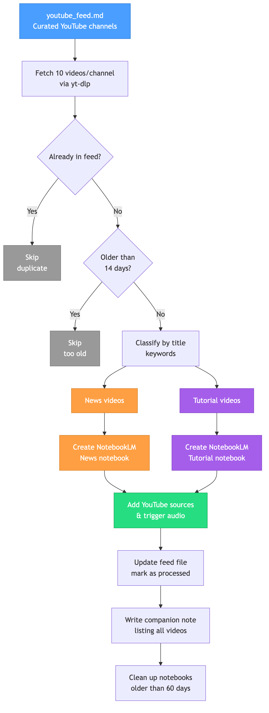

# YouTube Podcast Generator

Generate NotebookLM audio podcasts from curated YouTube channels.

## How It Works



1. You maintain a markdown feed file listing YouTube channels to follow
2. The script fetches recent videos, deduplicates against previously processed ones, and filters out anything older than 14 days
3. New videos are classified as **News** or **Tutorial** by title keywords and split into two separate NotebookLM notebooks
4. Audio podcast generation is triggered for each notebook
5. The feed file is updated, a companion note is written, and notebooks older than 60 days are cleaned up

## Prerequisites

- [yt-dlp](https://github.com/yt-dlp/yt-dlp) — `pip3 install yt-dlp` or `brew install yt-dlp`
- [notebooklm-py](https://github.com/teng-lin/notebooklm-py) — `pip3 install "notebooklm-py[browser]"`
- Run `notebooklm login` once to authenticate

## Quick Start

```bash
# Copy the example feed and add your channels
cp youtube_feed.example.md youtube_feed.md

# Preview what would happen
python3 youtube_research_podcast.py --dry-run

# Generate podcasts
python3 youtube_research_podcast.py
```

See [SKILL.md](SKILL.md) for full CLI flag reference.
